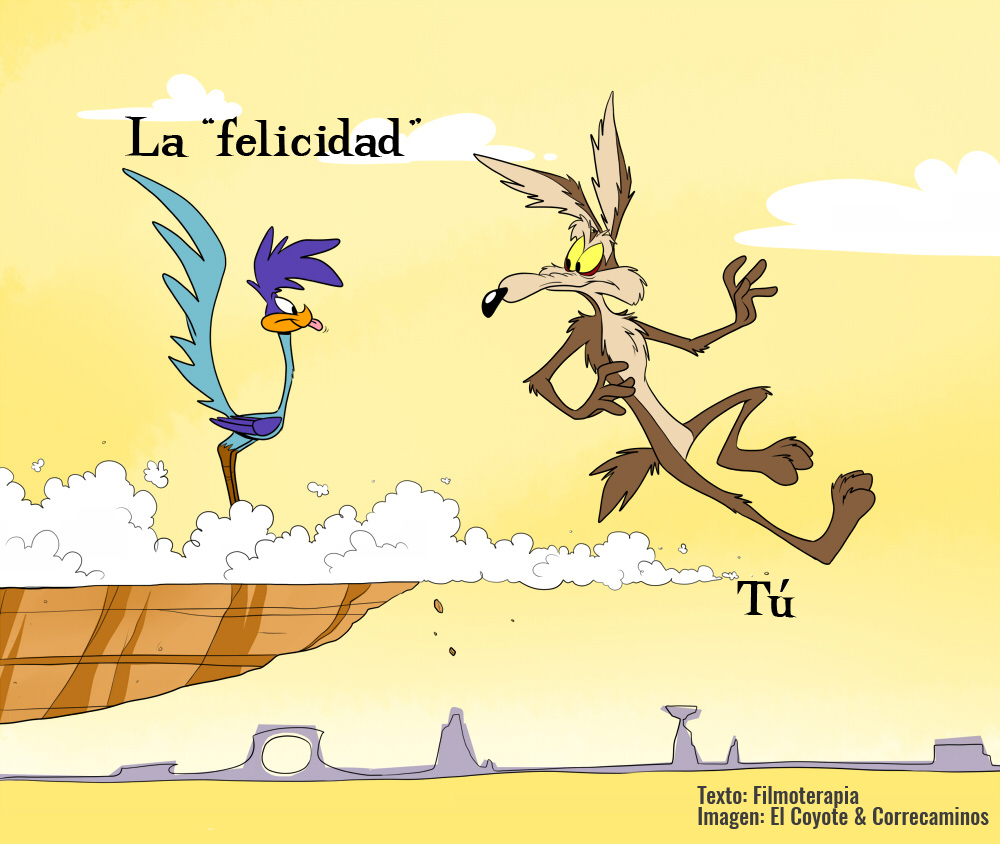

# Hola, esto es Markdown

**Escribo negrita**, *escribo cursiva* 

[enlaces](http://google.es) pero sí que he tocado muchos botones, no entiendo a que se refiere, *Sin tocar botones*.

## Listas

- Primer Elemento
- Segundo Elemento
	- Anidado

1. Númerada
2. Númerada 2

## Tarea Pendiente

- [x] Aprender a conectarme a git
- [ ] Entender lo que hago-

## Código

```javascript
const saludo = () => console.log("Hola Eleazar"); ```

## Tabla

| App | Plataforma | Precio |
| --- | ---------- | ------ |
| Obsidian | Multi | Gratis |
| Typora | Multii | 14,99$ |

> Lo simple es lo que mejor envejece.

Una imagen vale más que mil palabras



